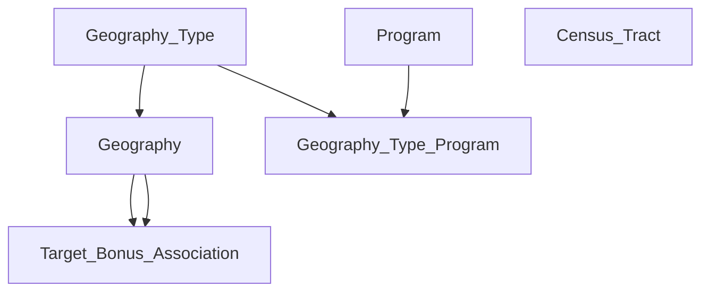

# Climate Cabinet Tax Credit Map

This project loads a PostGIS database with geographic features regarding tax credit programs.

## Dependencies

- Make
- Docker

## Structure

The pipeline is a Django project with specified management commands to clean, load, and sync data both locally and on Google Cloud Platform. It can be run in Docker Compose using the `docker-compose.yaml` file in the `pipeline` folder.
Running `docker compose up` will start a `PostGIS database` container, a `pgadmin` container at localhost:443, and a `Django` app container. The Django project runs an entrypoint script which runs the management commands which use `PyArrow` to load Geoparquets and store them in PostGIS. The files are large enough that they must be batched using Arrow to avoid substantial memory overhead.

## Quickstart - Local

_Basic Usage_

1. **Setup.** Download the `data` folder from [Google Drive](https://drive.google.com/drive/folders/1AO6Q-CpjOZwYqb3T1gsZg38jwMeYglsw) as a zipped file and then move it to the root of the project. Unzip the file and delete any remaining zip artifacts.

2. **Run the Pipeline.** From the project root, run the `make` command `run pipeline`. This builds Docker images for the PostgreSQL database server, pgAdmin database GUI, and Django pipeline and then runs those images as a network of containers using Docker Compose. After the last dataset has been loaded into a database, the pipeline container will automatically shut down while the database server and GUI keep running. The database's data is persisted as a Docker volume called "pgdata", which is saved as a folder under the project root.

3. **Query the Database with pgAdmin.** While PostgreSQL and pgAdmin are still running, navigate to `localhost:443`, select `servers`, and log in with the password `postgres`. [Browse tables and query the loaded data](https://www.pgadmin.org/docs/pgadmin4/latest/user_interface.html#user-interface) using raw SQL statements. (Note: If you would like to use pgAdmin in the future without re-running the pipeline, make sure that all Docker Compose services are shut down with `CTRL-C`. Then navigate to the root of the project and run the command `make run-database`, a wrapper for `docker compose up`, and follow the same instructions to log in.)

4. **Run the Dashboard.**  Shut down the current Docker compose application service by entering `CTRL-C`. Then run the new command `make run-dashboard`. This will spin up PostgreSQL and pgAdmin again but also build and run a Next.js dashboard that can be used to search for and view the loaded geographies on a map, along with their eligibility for various tax credit bonuses.

_Advanced Usage_

**Running Cleaning Pipeline.** The cleaning pipeline can be run locally by navigating to the `pipeline` directory and then entering the command `./manage.py clean_data`. TODO: Add instructions for Docker.

**Syncing Mapbox Tilesets.** TODO.

**Running Tests.** TODO.


## Database

Here are short descriptions of the tables that the app references:

- Geography_Type - summarizes the various types of territories that are referenced; this includes both the searchable regions (states, counties, municipal utilities, and rural coops) and areas associated with tax credit bonuses (justice 40, fossil fuel, distressed, and low income)
- Geography - contains the borders of geographical regions needed for the app
- Program - descriptions for all of the programs
- Geography_Type_Program - matches justice 40, fossil fuel, distressed, and low income areas with the programs they are eligible for
- Target_Bonus_Association - catalogs the overlaps between the searchable "target" areas with the "bonus" areas that are eligible for the tax credit programs in order to facilitate faster rendering
- Census_Tract - contains census tract centroids and populations; used to compute populations for various areas

Here is a visual of foreign key dependencies between the tables:



Here are a few examples of how queries are written to address the needs of the web app:

- Display all of the justice 40 communities that intersect with Florida's boundary

    ```
    SELECT * 
    FROM tax_credit_target_bonus_assoc a
        JOIN tax_credit_geography b
        ON a.bonus_geography_id = b.id
    WHERE target_geography_id = (
        SELECT id 
        FROM tax_credit_geography 
        WHERE NAME = 'Florida'
    )
    	AND a.bonus_geography_type = 'justice40'
    ```

- Compute the population of Florida

    ```
    SELECT sum(b.population)
    FROM tax_credit_geography a
        JOIN tax_credit_census_tract b
        ON ST_Within(
            b.centroid,
            a.boundary
        )
    WHERE a.name = 'Florida'
```
