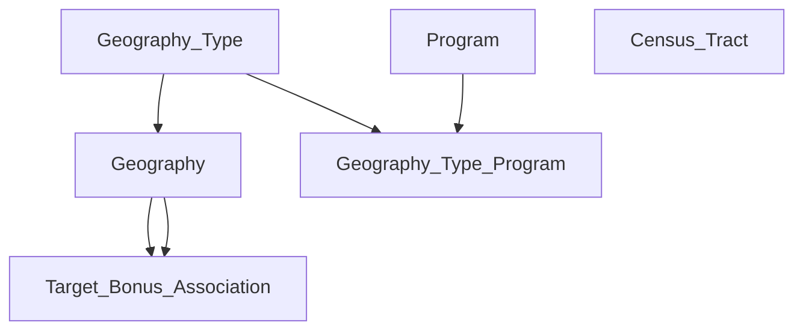

# Climate Cabinet Tax Credit Map

This project loads a PostGIS database with geographic features regarding tax credit programs.

# Structure

The pipeline is a Django project with specified management commands that load the data. 
It can be run in Docker compose using the docker-compose.yaml file in the `pipeline` folder.
Running `docker compose up` will start a `PostGIS database` container, a `pgadmin` container at localhost:443, and a `Django` app container.
The Django project runs an entrypoint script which runs the management commands which use `PyArrow` to load Geoparquets and store them in PostGIS.
The files are large enough that they must be batched using Arrow to avoid substantial memory overhead.

# Quick start - local

Download the data from `https://drive.google.com/drive/folders/1mZkpZ8t6a3VdtKyhO7xZSC6A233zPesN` and save it in a directory titled `data` in the root of the project. 
From the project root, run docker with `docker compose up`.
Navigating to `localhost:443`, selecting `servers`, and logging in with the password `postgres` will allow you to access and query the loaded data.

# Database

Here are short descriptions of the tables that the app references:

- Geography_Type - summarizes the various types of territories that are referenced; this includes both the searchable regions (states, counties, municipal utilities, and rural coops) and areas associated with tax credit bonuses (justice 40, fossil fuel, distressed, and low income)
- Geography - contains the borders of geographical regions needed for the app
- Program - descriptions for all of the programs
- Geography_Type_Program - matches justice 40, fossil fuel, distressed, and low income areas with the programs they are eligible for
- Target_Bonus_Association - catalogs the overlaps between the searchable "target" areas with the "bonus" areas that are eligible for the tax credit programs in order to facilitate faster rendering
- Census_Tract - contains census tract centroids and populations; used to compute populations for various areas

Here is a visual of foreign key dependencies between the tables:



Here are a few examples of how queries are written to address the needs of the web app:

- Display all of the justice 40 communities that intersect with Florida's boundary

    ```
    SELECT * 
    FROM tax_credit_target_bonus_assoc a
        JOIN tax_credit_geography b
        ON a.bonus_geography_id = b.id
    WHERE target_geography_id = (
        SELECT id 
        FROM tax_credit_geography 
        WHERE NAME = 'Florida'
    )
    	AND a.bonus_geography_type = 'justice40'
    ```

- Compute the population of Florida

    ```
    SELECT sum(b.population)
    FROM tax_credit_geography a
        JOIN tax_credit_census_tract b
        ON ST_Within(
            b.centroid,
            a.boundary
        )
    WHERE a.name = 'Florida'
```
